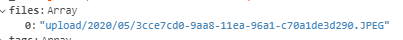

# 파일 서버 만들기

저번 시간에 이미지, 동영상(파일) 등을 받아와 데이터베이스에 버퍼(바이너리 코드)형태로 저장하는 방법을 사용했다. 그런데 버퍼가 너무 길고 효율이 좋지 않을것 같아 다른 방식으로 파일을 관리해 보았다.

## 방법

1. 서버에 파일들을 저장한다.
2. 데이터베이스에 파일의 경로를 저장한다.
3. 서버 주소로 파일을 접근할수 있다.

> 코드

코드의 일부분만 소개하므로 참고해서 본인의 코드에 적용하길 바란다.

```typescript
import Router from 'koa-router';
import koaBody from 'koa-body';
import { v1 as uuidv1 } from "uuid"; // 고유값 생성 위한 라이브러리

const router = new Router();

router.post('/', koaBody({
    multipart: true,
  }),
  async (ctx: any) => {
  const time = new Date();
  const month =
    time.getMonth() + 1 < 10 ? `0${time.getMonth() + 1}` : time.getMonth() + 1;
  const files = ctx.request.files.files;
  const fileDir = `upload/${time.getFullYear().toString()}/${month}`;
  const filesData: Array<string> = [];

  await mkdirFile(`public/${fileDir}`);
  if (files && files.name) {
    if (files.length) {
      for (const file of files) {
        let fileName = uuidv1();
        let extension = file.name.split(".").slice(-1)[0].toUpperCase();
        let path = `${fileDir}/${fileName}.${extension}`;
        if (!extensionList.includes(extension)) {
          ctx.status = 400;
          ctx.body = {
            error: "허용되지 않은 확장자",
          };
          return;
        }
        await saveFile(file, `public/${path}`)
          .then(() => filesData.push(path))
          .catch((err) => console.log(err));
      }
      await saveDatabase();
    } else {
      let fileName = uuidv1();
      let extension = files.name.split(".").slice(-1)[0].toUpperCase();
      let path = `${fileDir}/${fileName}.${extension}`;
      if (!extensionList.includes(extension)) {
        ctx.status = 400;
        ctx.body = {
          error: "허용되지 않은 확장자",
        };
        return;
      }
      await saveFile(files, `public/${path}`)
        .then(() => filesData.push(path))
        .catch((err) => console.log(err));
      await saveDatabase();
    }
  }
  await saveDatabase();
};)

const mkdirFile = (path: string) => {
  // 파일을 저장할 폴더를 생성하는 함수
  let pathList = path.split("/");
  let fileDir = ".";
  pathList.forEach((i) => {
    if (i) {
      fileDir += "/" + i;
      try {
        fs.lstatSync(fileDir).isDirectory(); // 경로가 존재하는지 판단
      } catch (e) {
        fs.mkdirSync(fileDir);
      }
    }
  });
};

const saveFile = (file: any, path: string) => {
  // 파일을 저장하는 함수
  return new Promise((resolve, reject) => {
    let render = fs.createReadStream(file.path); // 파일을 읽는다.
    let upStream = fs.createWriteStream(path); // 파일을 생성한다.
    render.pipe(upStream); // upStream과 render를 연결해서 완성된 파일을 저장한다.
    upStream.on("finish", () => {
      resolve(path);
    });
    upStream.on("error", (err) => {
      reject(err);
    });
  });
};
```

- fs.creteWriteStream이나, fs.lstatSync(fileDir).isDirectory() 에 쓰이는 path의 경로가 실험해본 결과 `./[FOLDER]`, `[FOLDER]`일땐 루트 디렉토리의 경로를 사용하고, `/[FOLDER]`일땐 다른 경로를 사용하는것 같다.
- `import { v1 as uuidv1 } from "uuid";`를 사용했는데 파일의 명이 겹치면 안되므로 고유한 값을 만들어주는 라이브러리를 사용했다.

### 결과


사진과 같이 지정 폴더경로에 파일이 저장되는것을 볼수 있다.



데이터베이스에는 파일의 경로를 저장해 두었다.

## url로 파일 접근하기

이것도 많은 방법이 있을텐데 나는 'koa-static'을 사용했다.

> 설치

```
yarn add koa-static @types/koa-static
```

> 적용법

```typescript
import Koa from 'koa'
import koaStatic from "koa-static";

const app = new Koa();

app.use(koaStatic("upload")); // 매개변수로 upload를 넘겨줬는데 이는 루트디렉토리 > upload에 있는 파일을 접근할수 있게 한다. 예를들어 'http://localhost/[파일 이름]'를 통해 접근 가능하다.

...
```

### 결과


사진과 같이 url을 통해 파일을 접근할수 있다.
