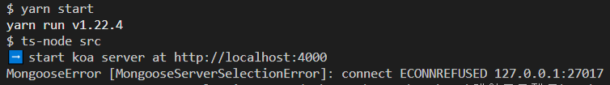
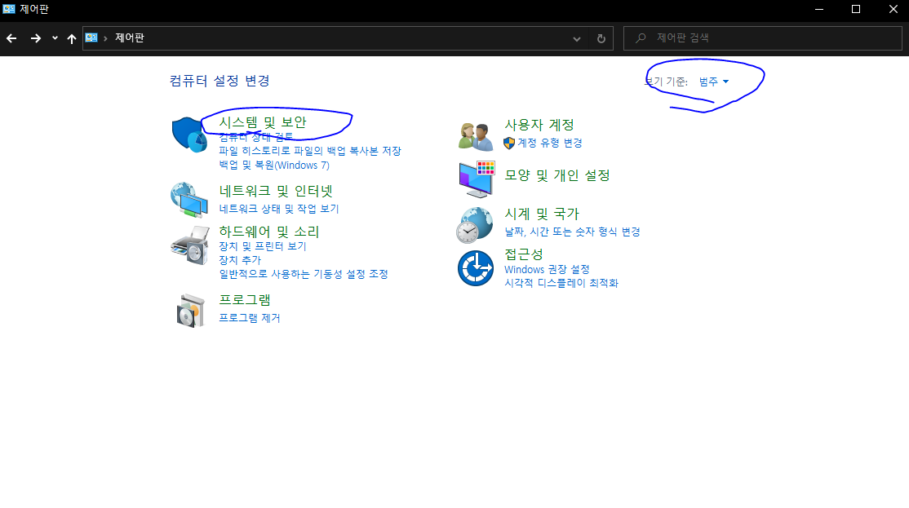
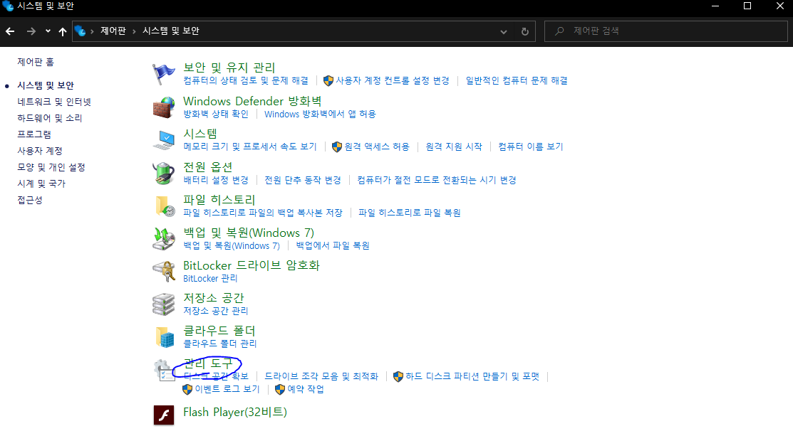
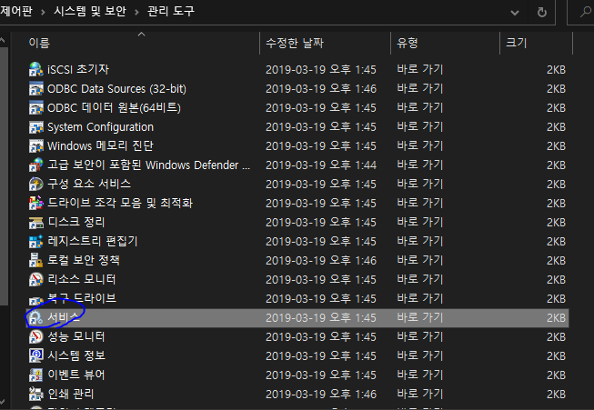
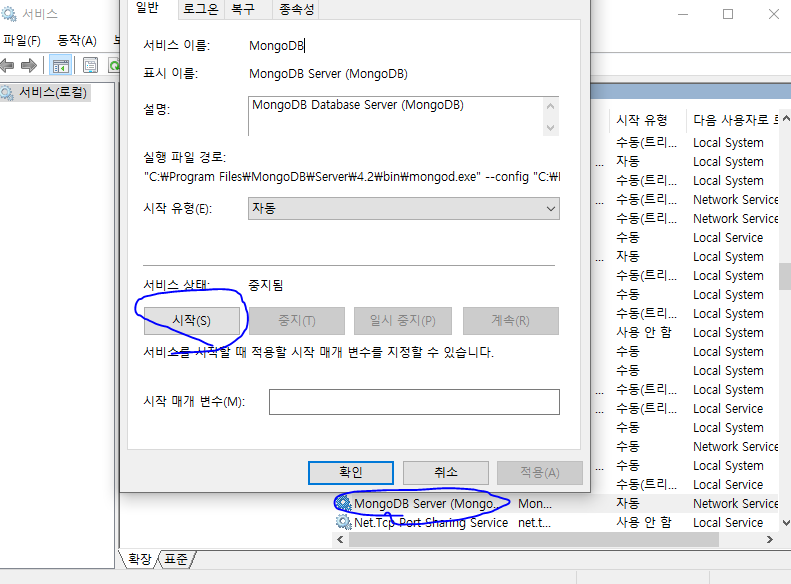

# ECONNREFUSED

nodejs로 mongodb에 연결을하면 처음엔 잘되다가 계속 에러가 난다. 처음에는 컴퓨터를 재시작하면 다시 작동이 돼 이렇게 지냈는데 너무 답답해서 구글링을 통해 해결 방법(? 임시방편)을 알아냈다.

위와 같은 오류가 난다.

- MongooseError [MongooseServerSelectionError]: connect ECONNREFUSED 127.0.0.1:27017

## 해결법

윈도우 사용자 기준으로 설명하겠다.

사진과 같이 mongo 서비스를 재시작해주면 잘 작동할것이다. 나의 경우엔 그랬다.
